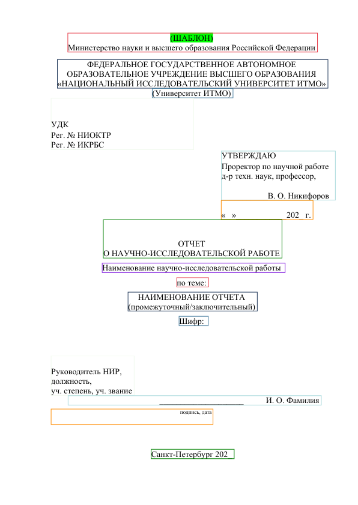
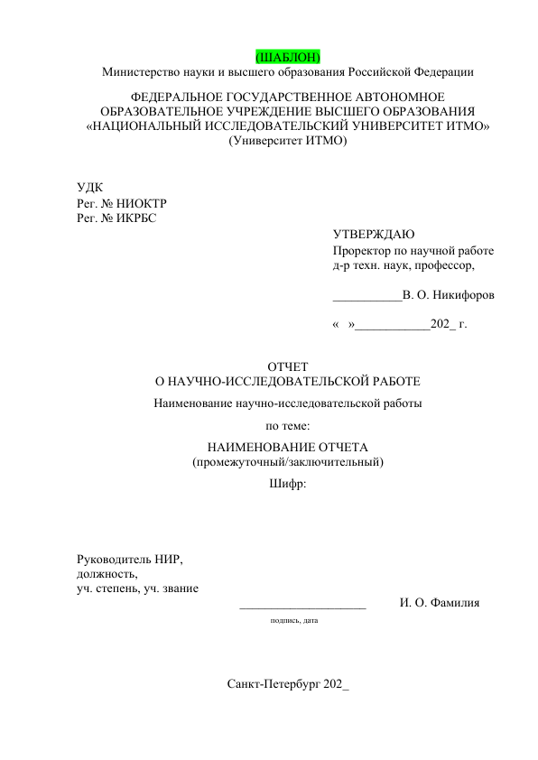
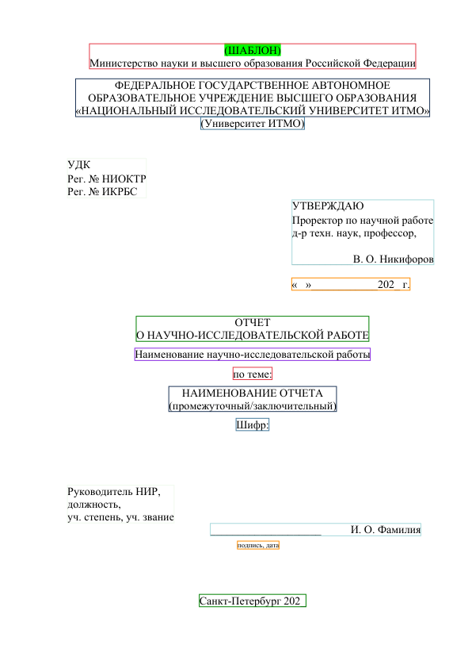
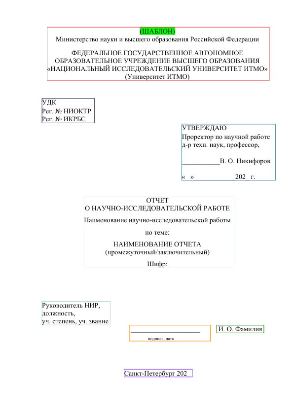

# textblock-clustering

Minimal, practical text span clustering for PyMuPDF documents. This repository focuses on turning low-level PDF spans into readable blocks using a BFS-based clustering algorithm, with optional watermark filtering.

## Highlights

- Clusters spans into blocks with a lightweight BFS heuristic.
- Filters out likely watermark spans (URLs, emails, near-white text).
- Ships a visual demo that compares PyMuPDF extraction modes vs. the custom clustering output.
- Simple, dependency-light, and easy to tweak for form-like PDFs.

## Requirements

- Python >= 3.10
- `pymupdf`

## Install

```bash
pip install -e .
```

## Quick Start

```python
import fitz
from textblock_clustering import TextClustering

with fitz.open("file.pdf") as doc:
    page = doc.load_page(0)
    clustering = TextClustering(page)
    blocks = clustering.cluster_spans_bfs()

for block in blocks:
    print(block.text)
```

## Demo

The demo script renders the first page, draws bounding boxes for four PyMuPDF extraction modes, and then renders the clustering result. It also writes a Markdown report comparing extracted text.

Run:

```bash
uv run examples/demo.py
```

Select the PDF at the top of `examples/demo.py`:

```python
SELECTED_PDF = 'SR_Example.pdf'
```

Artifacts are saved in `examples/artifacts`.

## Visual Comparison

Below are example outputs generated from `examples/data/SR_Example.pdf`.

### PyMuPDF: blocks



### PyMuPDF: dict


### PyMuPDF: rawdict



### PyMuPDF: words



### Custom clustering (this project)



The textual comparison report for the same run:

- `examples/artifacts/report_SR.md`

## How It Works (Brief)

1. Extract spans from `page.get_text('dict')`.
2. Optionally filter spans that look like watermarks.
3. Build a proximity graph using Euclidean distance between span centers.
4. Apply line-based adjacency with overlap tolerance to catch aligned spans.
5. Run BFS to cluster spans into blocks.
6. Merge short spans and inject missing underscore lines for signature fields.

The intent is to be predictable and easy to tune for form-like layouts rather than to solve all layout analysis cases.

## Configuration

Core parameters live in `src/textblock_clustering/constants.py`:

- `DISTANCE_THRESHOLD_DEFAULT`
- `BFS_VERTICAL_TOLERANCE`
- `OVERLAP_THRESHOLD_DEFAULT`
- `SHORT_SPAN_LIMIT_DEFAULT`
- `LINE_GAP_HEIGHT_MULTIPLIER`

These control how aggressively spans are grouped. Start by tweaking `DISTANCE_THRESHOLD_DEFAULT` and `LINE_GAP_HEIGHT_MULTIPLIER` for your PDFs.

## Development

```bash
uv run examples/demo.py
```

## Contributing

See `CONTRIBUTING.md`.

## Code of Conduct

See `CODE_OF_CONDUCT.md`.

## Changelog

See `CHANGELOG.md`.

## License

MIT. See `LICENSE`.

[](https://star-history.com/#Kerysfel/fitz-block-repair&Date)
